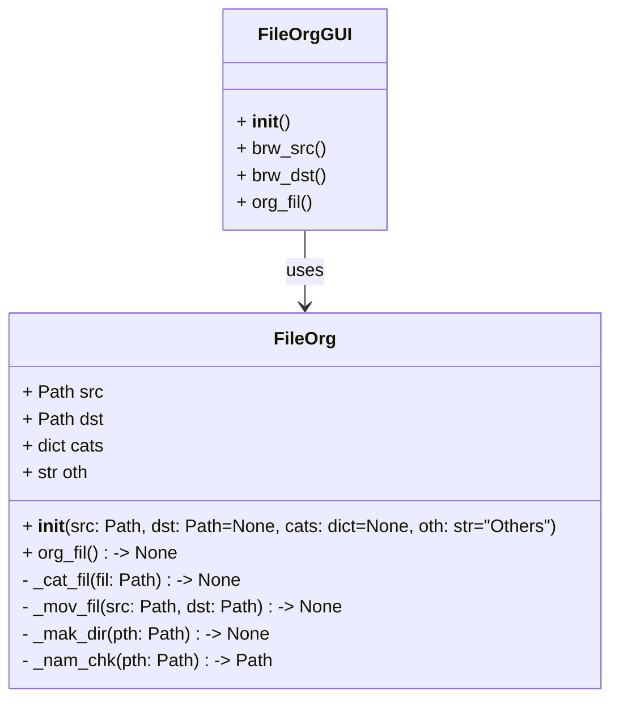

# Smart File Organizer


[View Code on GitHub](https://github.com/Sangaturcarawan/smart-file-org)


A personal Python project that automatically organizes files in your **Downloads** folder into categorized subfolders.

This is the **fifth iteration (v5.0)** which introduces a **PyQt6 GUI** for better usability. Users can select their own source and destination folders, name their own folder to put uncategorized files, and organize files with a single click.

Built using `pathlib`, `shutil` and `typing` and `PyQt6`.

---

## Features

- GUI interface to select source and destination folder and folder name for uncategorized files
- Sorts files based on file extension into folders: audio, archives, documents, images, videos and others

| **Subfolder** | **File Extensions**                                           |
| :-----------: | :------------------------------------------------------------ |
|   **Audio**   | - `.aac`<br> - `.flac`<br> - `.mp3`<br> - `.wav`              |
| **Archives**  | - `.zip`<br> - `.rar`<br> - `.gz`                             |
| **Documents** | - `.docx`<br> - `.pdf`<br> - `.txt`<br> - `.xlsx`             |
|  **Images**   | - `.jpg`<br> - `.jpeg`<br> - `.png`<br> - `.gif`<br> - `.bmp` |
|  **Videos**   | - `.avi`<br> - `.mkv`<br> - `.mov`<br> - `.mp4`               |

- Prevents naming conflicts by appending (1), (2), etc
- Cross-OS compatibility (Windows/macOS/Linux/WSL)
- Code is modular:
  - smart_fil_org.py uses a CLI based input
    - `mak_dir()` &rarr; creates subfolders if they do not exist
    - `mov_fil()` &rarr; moves files to correct subfolder & prints an update
    - `_nam_chk()` → handles naming conflicts by creating unique filenames
    - `org_fil()` → carries out file organization by category
  - smart_fil_org_gui.py uses a GUI based input using PyQt6
  - Future expansion to include sorting by metadata and regex

---

## UML Diagram / Architecture



---

## Installation & Usage

1. Open a terminal (Linux/macOS) or Gitbash / WSL (Windows)
2. Clone the repo:

```bash
git clone https://github.com/Sangaturcarawan/smart-file-org.git
```
3. Go to repository
```bash
cd smart-file-org
```
4. Create a Virtual Environment & activate it
```Bash
python3 -m venv .venv
source .venv/bin/activate # macOS/Linux
.venv\Scripts\activate # Windows
```
5. Install the required dependencies
```Bash
pip install -r requirements.txt
```
6. Run the script(s):
```bash
python3 smart_fil_org.py # CLI based input
python3 smart_fil_org_gui.py # GUI based input
```

### Example

Before running the script:

```text
Downloads/
├─ report.pdf
├─ song.mp3
├─ archive.zip
```

After running the script:

```text
Downloads/
├─ Documents/
│  └─ report.pdf
├─ Audio/
│  └─ song.mp3
├─ Archives/
│  └─ archive.zip
```

Output:

```text
Moved report.pdf → Documents
Moved song.mp3   → Audio
Moved archive.zip → Archives
```

## Future Updates (v5.0+)

- Handle multi-part file extensions (e.g., `.tar.gz`) correctly.
- Sort files by creation or modification date using `datetime` module.
- Metadata-based sorting
- Optional web app with Flask / Django
- Auto-detect file types without hardcoding extensions in dictionaries.
- Cross-OS enhancements and configuration via JSON.

## Updates / Version History

Please visit [CHANGELOG.md](CHANGELOG.md)

## License

This project is licensed under the MIT License – see [LICENSE](LICENSE) for details.
